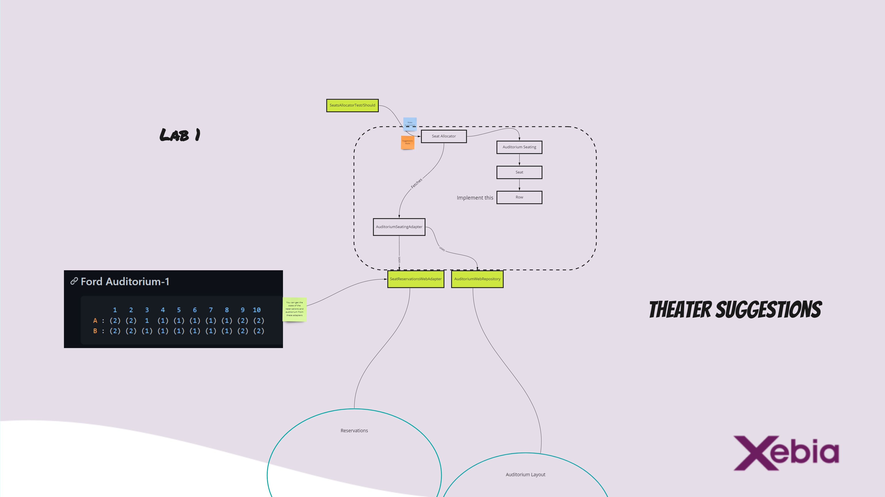

# Implementing a Bounded Context in Code

This repository has several labs to guide you from tests to production ready software in Java and C#.

There are 4 labs that build up on each other and you can reach them through the branches. Each Lab has a start and a end solution.
Here are the labs:

* Lab 1 - Implementing a bounded context using Outside-in TDD
* Lab 2 - Supple design - Make the potential of the model clear
* Lab 3 - Deep Model - refactoring to deeper insights (There are two parts to this lab)
* Lab 4 - Coding Lab 4: Ports and Adapters aka Hexagonal architecture - Protecting your bounded context domain model

## Lab 1 - Implementing a bounded context using Outside-in TDD

Your task is to let the two tests in SeatAllocatorShould test pass on to the model we designed in the responsiblity mapping. You can do this by yourself, in a pair or even do a ensemble programming with multiple people.
Start implementing the tests using the ExternalDependencies `AuditoriumSeatingAdapter` were you can `GetAuditoriumSeating` to use 'AuditoriumSeating' as input state to your model for the examples modelled in the example mapping.

You can find the states visualised in `../../AuditoriumLayoutExamples.md`, use the corresponding ID to call the state.

We won't be doing puristic TDD, as in we will use the domain model designed from the responsbility mapping to create objects which are the expression of our ubiqituous language in code. You can just create them in the TheatherSuggestions.Tests project and focus on passing the tests on our domain model. We deal with project structure in a later lab.



## Lab 2 - Supple design - Make the potential of the model clear

We extracted our domain model to the `SeatsSuggestions` project, and refactored our stub/fake mechanism int he Tests. Now it is time to implement the next test in `SeatAllocatorShould` called `Offer_several_suggestions_ie_1_per_PricingCategory_and_other_one_without_category_affinity` which fails. You need to find out why it failed, that is why we gave you a couple of unit tests to work with and find the bug!

## Lab 3 Part 1 - Offer seats nearer to the middle of a row

Now that we used the tactical patterns to make our design more supple to changes of our business, we can start implementing more complex domain logic.
In lab 3, part 1 we added a new failing Acceptance Test that we modeled together in Example Mapping about offering seats nearer to the middle of a row.
We also added two new unit test to the 'RowShould' that fails that will help you implement the test. You can first have a discussion how you would design this more complex domain logic.

## Lab 3 Part 2 - Offer seats nearer to the middle of the row when possible

In part 1 we started to implement the first part of the deep model. In this second part you will continue designing the deeper model with offering seats nearer to the middle of the row when possible as modeled in our example mapping.

## Lab 4 - Ports and Adapters aka Hexagonal

Now that we have a deeper understanding and probed our model in code, it is time to make it production ready! For that we use the Ports and Adapters architecture.
The current state the code is in, works. You can run the two External API in that project, and then start the SeatsSuggestions.Api and call ` http://localhost:8080/api/SeatsSuggestions?showId=1&party=3` and you should get the following output   
```
{
  "forCategory": {
    "Second": [],
    "Mixed": [
      {
        "suggestedSeats": [
          {
            "rowName": "A",
            "number": 3,
            "pricingCategory": "First",
            "seatAvailability": "Available",
            "available": true
          }
        ],
        "partyRequested": 1,
        "pricingCategory": "Mixed"
      }
    ],
    "First": [
      {
        "suggestedSeats": [
          {
            "rowName": "A",
            "number": 3,
            "pricingCategory": "First",
            "seatAvailability": "Available",
            "available": true
          }
        ],
        "partyRequested": 1,
        "pricingCategory": "First"
      }
    ],
    "Third": []
  }
}
```

Now we want to split up our code to the Domain and Infra projects we created, so as to split Domain logic from Infra logic. If you want you can extend towards Clean Architecture and create a usecase in the domain project.
You want to keep the code and tests working along the way, perhaps even in the end create your own system test :).
